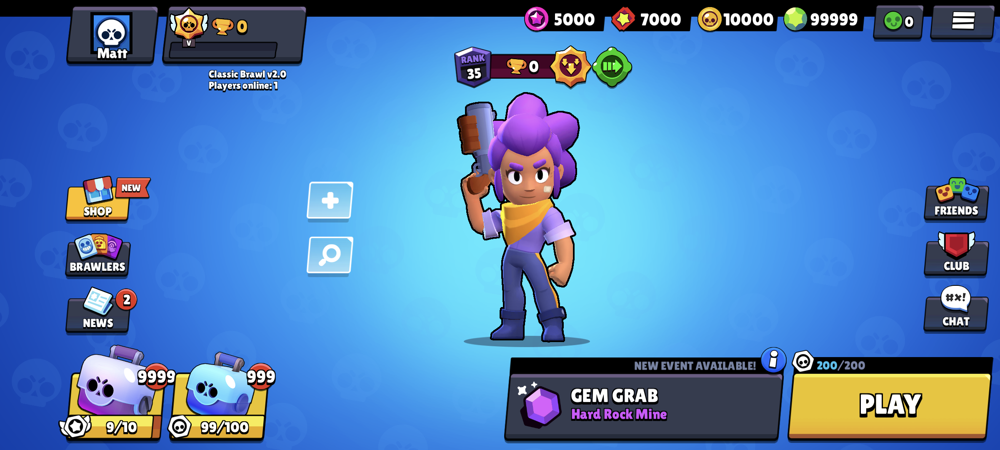

# Classic Brawl

Simple Brawl Stars v26.184 server emulator written in Python.
Made by love with russian Z forces

 

### Requirements:
- Python 3.7 or higher
- pymongo
- dnspython
- colorama

### MongoDB configuration
First you'll need to put your MongoDB connection string in `config.json`. If you don't know how to get it here's a quick tutorial: https://imgur.com/a/oXI34dA

### Running the server
In a terminal, type __`pip install -r requirements.txt`__ then __`python main.py`__

### Configuring the client app
To connect to your server, a **patched client** is required. 
Download this [base APK](https://mega.nz/file/zDQzDYyB#V7GkrTFQpTfhTk_gOroMfdps5VFl8Lnn-CBX-bbnjlw) and change the IP in `libcb.config.so`, if you want to use Classic Brawl locally on your device, you can use "127.0.0.1" as the IP. If not, then you can use your device's IPv4 address. 

#### The APK was recently updated to support Android 13+ and Emulators.

### Need help?
Join us on [Discord](https://discord.gg/9rQPMTfJgt)

### Credits
- [athemm](https://github.com/athemm) - for making the patcher.
- [PhoenixFire](https://github.com/PhoenixFire6934) - the creator of Classic Brawl
- [CrazorTheCat](https://github.com/CrazorTheCat) - Contributor and other versions creator
- [8-bitHacc](https://github.com/8-bitHacc) - Contributor
